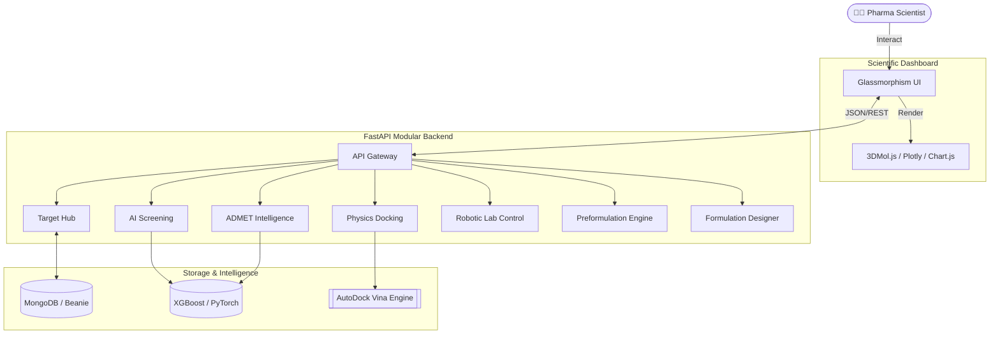
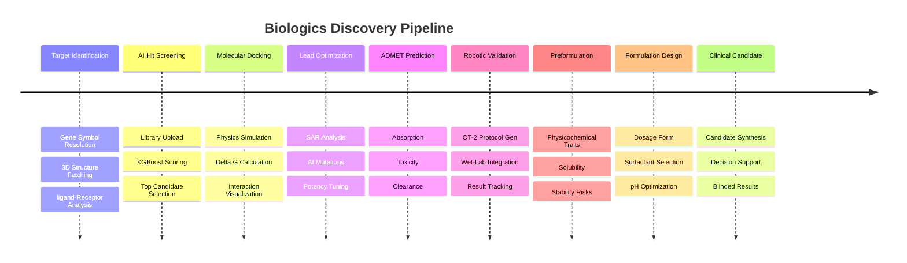

# 🧬 Biologics Discovery Platform

An advanced, production-grade AI drug discovery platform designed for pharmaceutical scientists. This platform accelerates the drug discovery pipeline from identifying protein targets to screening millions of compounds using cheminformatics and machine learning.

 <!-- Placeholder for actual UI screenshot -->

## 🚀 Key Features

*   **Target Identification (Neural-Bio Interface):** Instantly resolve gene symbols (e.g., EGFR, TP53) to UniProt primary accessions. Automatically fetches genomic sequences, verified 3D structures from **RCSB PDB**, and AlphaFold predictions.
*   **Virtual Hit Screening:** Converts compounds into 2400+ dimensional mathematical features to predict binding affinities (pIC50) using an optimized **XGBoost Regressor**.
*   **Molecular Docking:** physics-based docking simulations using **AutoDock Vina** to calculate binding energies and visualize ligand-receptor interactions.
*   **Lead Optimization:** Generative AI strategies for bio-realistic structural modifications to improve potency and safety.
*   **ADMET Intelligence:** Automated prediction of Absorption, Distribution, Metabolism, Excretion, and Toxicity profiles.
*   **Robotic Validation:** Integration with **Opentrons OT-2** for automated wet-lab validation and protocol generation.
*   **Preformulation Analysis:** Physicochemical stability engine calculating API traits, solubility predictions, and stability risks.
*   **Formulation Design:** AI-driven design of drug delivery systems, suggesting optimal dosage forms, surfactants, and pH environments.
*   **Clinical Candidate Selection:** Final synthesis of pipeline data to identify the most viable candidates for clinical trials.

---

## 🏗️ High-Level Architecture

The platform follows a modular, production-grade architecture designed for high-throughput scientific analysis.



---

The platform maps the real-world drug development pipeline into a digital workflow.



### Supported Data Formats (Hit Screening)
The `app/utils/file_parsers.py` utility normalizes various scientific data formats into a unified SMILES pipeline:
- **`2D/1D Text`**: `.smi`, `.txt`, `.csv` (Auto-detects canonical smiles and activity columns)
- **`3D Structures`**: `.sdf`, `.sd`, `.mol2` (Extracts structures using RDKit libraries)
- **`BioAssay Data`**: `.json` (Parses PubChem concise JSON and flat arrays, performs batch API lookups for CID → SMILES resolution)
- **`LCMS Data`**: `.mzml`, `.mzxml` (Lightweight MS parsing, maps formulas to drug databases)

---

## 💻 Tech Stack

*   **Frontend:** Vanilla HTML5, CSS3 (Glassmorphism UI), JavaScript, `3Dmol.js`
*   **Backend:** Python 3.11, FastAPI, Uvicorn (Asynchronous REST API)
*   **Machine Learning / Cheminformatics:** RDKit, XGBoost, Scikit-learn, Pandas, NumPy
*   **Database Integration:** MongoDB / Beanie (Document Storage)

---

## 🛠️ Installation & Setup

You can deploy and run the Biologics Discovery Platform in two ways: **using Docker (highly recommended for production/quick-start)** or **running locally in a Python environment**.

---

### 🐳 Option A: Running with Docker (Recommended)

Docker handles all scientific dependencies (like RDKit, scikit-learn, etc.), installs the physics-based docking engine (**AutoDock Vina**), and automatically pre-trains the core AI models during the build phase so the container is ready instantly.

#### Prerequisites
*   [Docker](https://www.docker.com/products/docker-desktop/) installed on your machine.
*   [Docker Compose](https://docs.docker.com/compose/install/) (if running with database bundled).

#### 1. Quick Start: Local Stack (FastAPI App + MongoDB Container)
Spin up the complete platform—including a local persistent MongoDB instance—with a single command:
```bash
docker-compose up --build
```
Once initialized, the platform will be available at:
*   **Web Application**: [http://localhost:8000](http://localhost:8000) (Serves the interactive dashboard & login page)
*   **Interactive API Docs (Swagger UI)**: [http://localhost:8000/docs](http://localhost:8000/docs)

#### 2. Standalone Deployment (Using external MongoDB / Cloud Atlas)
If you want to run the application container separately and connect it to your existing cloud MongoDB cluster (configured in `backend/.env`):
1. **Build the Docker Image**:
   ```bash
   docker build -t biologics-platform .
   ```
2. **Run the Standalone Container**:
   Pass your `.env` configuration directly into the container:
   ```bash
   docker run -d -p 8000:8000 --env-file backend/.env --name biologics-platform biologics-platform
   ```

---

### 💻 Option B: Manual Local Setup (Development)

#### Prerequisites
*   **Python 3.10+** (Recommended)
*   **MongoDB** (Ensure local instance is running, or obtain a cloud MongoDB Atlas URI)

#### 1. Setup Backend & Virtual Environment
Navigate to the `backend` directory, create a virtual environment, and install dependencies:
```bash
cd backend
python -m venv venv

# Activate Virtual Environment:
# On Windows:
venv\Scripts\activate
# On Linux/macOS:
source venv/bin/activate

# Install requirements
pip install -r requirements.txt
```

#### 2. Train the Core AI Models
Before running the platform, compile the AI Regressors (XGBoost) and Classifiers locally. This will generate your pickle serialized models (`binding_affinity_model.pkl` & `bbbp_model.pkl`):
```bash
# Still inside backend directory
python train_ai_model.py
python app/ai_models/train_bbbp.py
```

#### 3. Run the Application
Start the FastAPI server. It is configured to serve both the backend APIs and the static frontend templates simultaneously:
```bash
uvicorn app.main:app --reload --host 127.0.0.1 --port 8000
```
Open your web browser and navigate to:
*   **Platform UI**: [http://127.0.0.1:8000](http://127.0.0.1:8000)
*   **API Documentation**: [http://127.0.0.1:8000/docs](http://127.0.0.1:8000/docs)

*(Note: For Windows users, you can also double-click `run_platform.bat` to automate the local environment creation, model training, and server launch in one go!)*

---


## 🧪 Testing

The platform includes a set of pre-generated test datasets in `backend/test_datasets/` covering every supported format:
- `sample_library.smi` (SMILES)
- `sample_library.csv` (CSV with activity columns)
- `sample_library.sdf` (3D Structures)
- `sample_library.mol2` (3D Structures)
- `sample_bioassay.json` (PubChem BioAssay JSON)
- `sample_lcms.mzml` (LCMS mzML)

You can upload any of these files directly into the Hit Screening UI to validate the parsing and inference pipelines.
